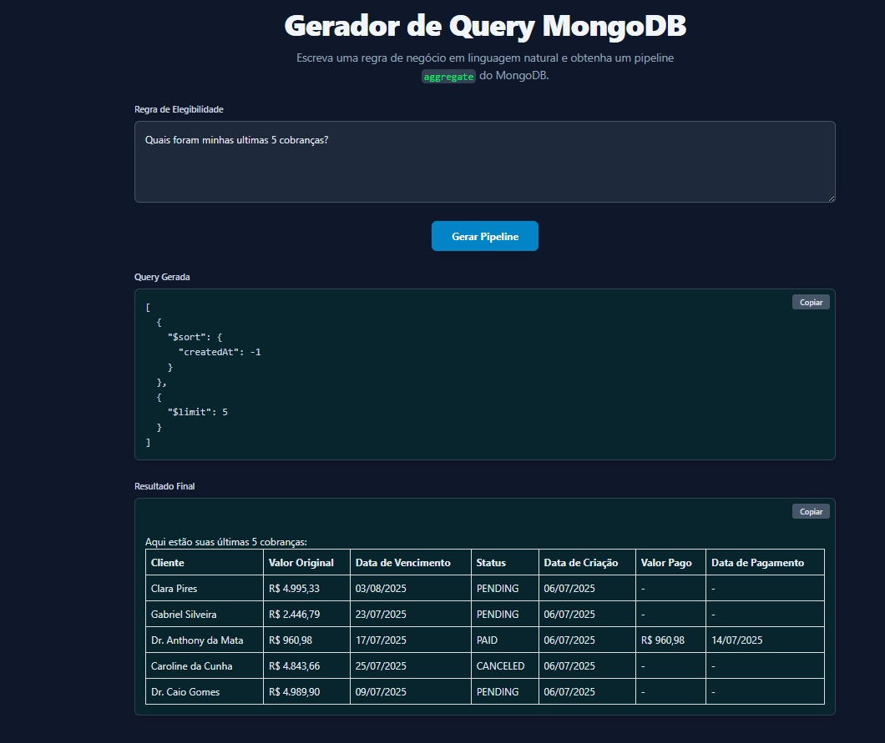
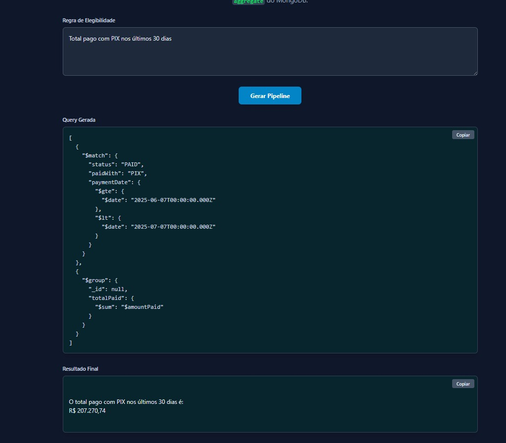
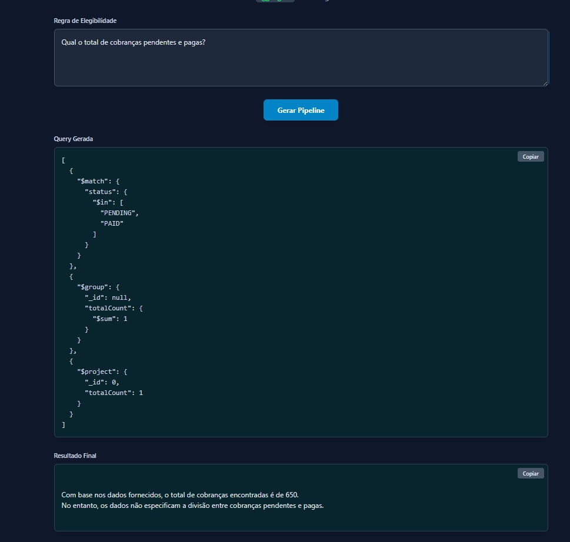

# Gemini Mongo Query 🔍💬

Projeto experimental que utiliza a API do **Gemini (Google Generative AI)** para gerar **consultas MongoDB (Aggregation Pipeline)** a partir de **perguntas em linguagem natural**. Ideal para explorar integração entre IA generativa e bancos NoSQL.
O resultado apresentado em tela é a **query criada** para a consulta dos dados e a resposta da IA pro usuário final.

## 🚀 Funcionalidades

-   ✨ Transformação de perguntas em linguagem natural para queries MongoDB.
    
-   📊 Formatação amigável das respostas.
    
-   🔁 Suporte a prompts personalizados via LangChain.
    
-   🔧 Fácil adaptação para outras coleções ou domínios.

🧠 Exemplo de Uso

Abaixo estão alguns prints com exemplo de uso:

  

  

  

### OBS: **Como podem ver nesta última imagem, ainda há muitas melhorias que poderiam ser feitas.**

## ⚙️ Como rodar localmente

1.  **Instale as dependências**

	`npm install` 

2.  **Configure as variáveis de ambiente no backend**  
    Crie um arquivo `.env` com base no `.env.example`:

	`API_KEY=sua_chave_google_genai` 

3.  **Rode os comandos**
	`docker-compose up -d` para subir o MongoDB;
	
	`npm run seed` para criar uma base collection (**charges**) com 1000 registros no banco **ia_testing**;
	
4.  **Execute o projeto**
	`npm run dev`

## 🧩 Tecnologias Utilizadas

- [Google Generative AI SDK](https://www.npmjs.com/package/@google/generative-ai)

- [Docker](https://www.docker.com/)
    
- [MongoDB](https://www.mongodb.com/)

- [LangChainJS](https://www.npmjs.com/package/langchain)
    
- [Node.js](https://nodejs.org/)
    
- [TypeScript](https://www.typescriptlang.org/)
    

## 📝 Considerações Finais

O projeto **Gemini Mongo Query** demonstra como modelos de linguagem podem ser utilizados para traduzir perguntas em linguagem natural em consultas estruturadas no MongoDB.

A combinação de IA generativa com dados estruturados abre caminho para experiências mais intuitivas e poderosas no uso cotidiano de dados.

Sinta-se à vontade para contribuir, adaptar ou sugerir melhorias — este projeto é um ponto de partida, não um produto final. 🚀

# Gemini Mongo Query 🔍💬

Projeto experimental que utiliza a API do **Gemini (Google Generative AI)** para gerar **consultas MongoDB (Aggregation Pipeline)** a partir de **perguntas em linguagem natural**. Ideal para explorar integração entre IA generativa e bancos NoSQL.
O resultado apresentado em tela é a **query criada** para a consulta dos dados e a resposta da IA pro usuário final.

## 🚀 Funcionalidades

-   ✨ Transformação de perguntas em linguagem natural para queries MongoDB.
    
-   📊 Formatação amigável das respostas.
    
-   🔁 Suporte a prompts personalizados via LangChain.
    
-   🔧 Fácil adaptação para outras coleções ou domínios.

🧠 Exemplo de Uso

Abaixo estão alguns prints com exemplo de uso:

## ⚙️ Como rodar localmente

1.  **Instale as dependências**

	`npm install` 

2.  **Configure as variáveis de ambiente no backend**  
    Crie um arquivo `.env` com base no `.env.example`:
	`API_KEY=sua_chave_google_genai` 

3.  **Rode os comandos**
	`docker-compose up -d` para subir o MongoDB;
	`npm run seed` para criar uma base collection (**charges**) com 1000 registros no banco **ia_testing**;
	
4.  **Execute o projeto**
	`npm run dev`

## 🧩 Tecnologias Utilizadas

- [Google Generative AI SDK](https://www.npmjs.com/package/@google/generative-ai)

- [Docker](https://www.docker.com/)
    
- [MongoDB](https://www.mongodb.com/)

- [LangChainJS](https://www.npmjs.com/package/langchain)
    
- [Node.js](https://nodejs.org/)
    
- [TypeScript](https://www.typescriptlang.org/)
    

## 📝 Considerações Finais

O projeto **Gemini Mongo Query** demonstra como modelos de linguagem podem ser utilizados para traduzir perguntas em linguagem natural em consultas estruturadas no MongoDB.

A combinação de IA generativa com dados estruturados abre caminho para experiências mais intuitivas e poderosas no uso cotidiano de dados.

Sinta-se à vontade para contribuir, adaptar ou sugerir melhorias — este projeto é um ponto de partida, não um produto final. 🚀

# License

Released under the MIT License.